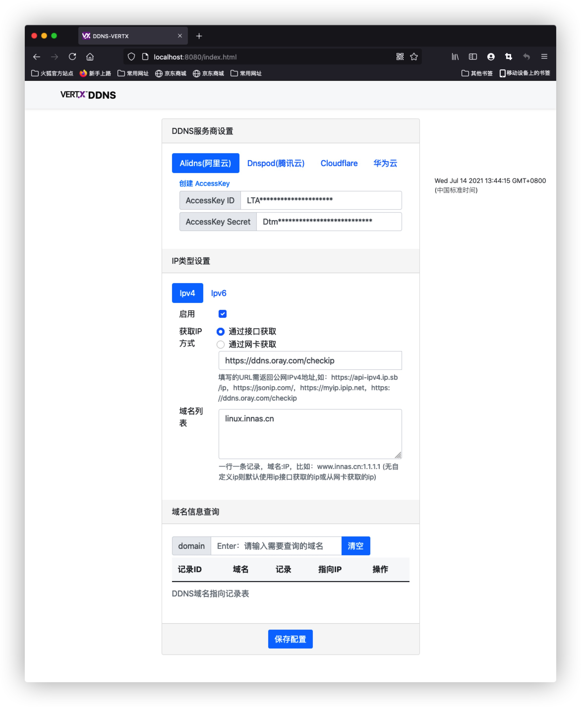

	<a target="_blank" href="https://www.oracle.com/technetwork/java/javase/downloads/index.html">
		</img>
	</a>

# ddns-vertx

自动获得你的公网 IPv4 或 IPv6 地址或使用您的自定义IP地址，并解析到对应的域名服务。

<!-- TOC -->

- [ddns-vertx](#ddns-vertx)
  - [功能](#功能)
  - [系统中使用](#系统中使用)
  - [Docker中使用](#docker中使用)
  - [使用IPv6](#使用ipv6)
  - [界面](#界面)
  - [开发&自行编译](#开发自行编译)

<!-- /TOC -->

## 功能

- 支持Mac、Windows、Linux系统，支持ARM、x86架构
- 支持的域名服务商 `Alidns(阿里云)` `Dnspod(腾讯云)` `Cloudflare` `华为云`
- 支持接口/网卡获取IP
- 支持以服务的方式运行
- 默认间隔5分钟同步一次
- 支持同时使用多个服务商解析
- 支持多个域名同时解析，公司必备
- 支持多级域名
- 支持查询服务商域名解析记录  
- 网页中配置，简单又方便，可设置 `登录用户名和密码` / `禁止从公网访问`
- 网页中方便快速查看最近50条日志，不需要手动查看运行日志中查看

