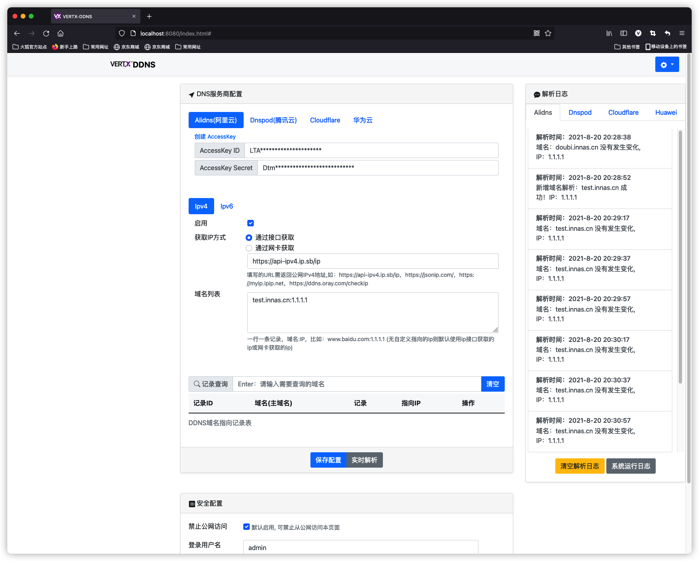
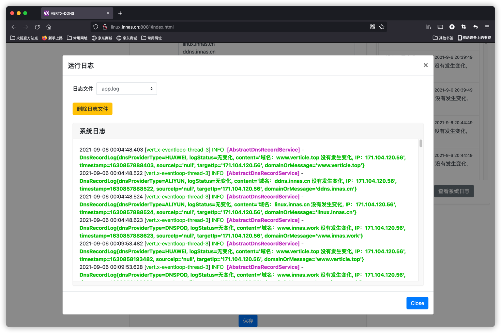
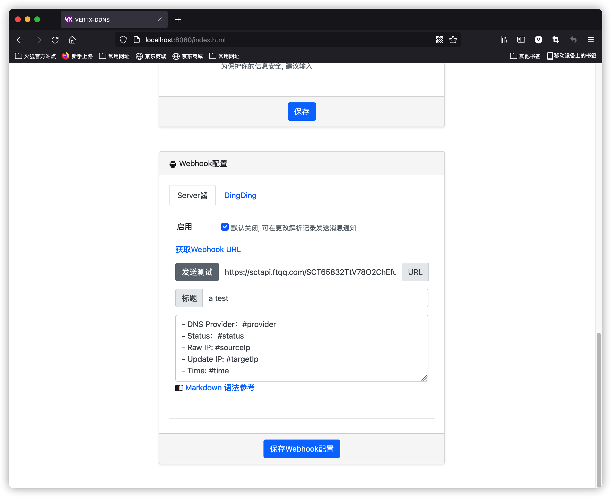

<p align="center">
	<a target="_blank" href="https://github.com/gngpp/vertx-ddns/blob/main/LICENSE">
		
	</a>
	<a target="_blank" href="https://www.oracle.com/technetwork/java/javase/downloads/index.html">
		
	</a>
	<a target="_blank" href="https://github.com/gngpp/vertx-ddns/actions">
		
	</a>
	<a target="_blank" href="https://github.com/gngpp/vertx-ddns/actions">
		
	</a>
	<a target="_blank" href="https://github.com/gngpp/vertx-ddns/releases/latest">
		
	</a>
	<a target="_blank" href="https://hub.docker.com/r/gngpp/vertx-ddns">
		
	</a>
</p>

### 简介
基于`Vert.x`事件驱动的DNS解析服务，支持DDNS，自动获取设备公网 `IPv4` 或 `IPv6` 地址或使用自定义的`IP`地址，并解析到对应的域名服务。

- [vertx-ddns](简介)
  - [功能](#功能)
  - [使用前必看](#使用前必看)
  - [系统中使用](#系统中使用)
  - [Docker中使用](#Docker中使用)
  - [开发&自行编译](#开发自行编译)
  - [Webhook](#Webhook)
  - [FAQ](#FAQ)
  - [响应式布局](#界面)
  - [License](#License)
<!-- /TOC -->

### 功能

- 支持Mac、Windows、Linux系统，支持平台架构：`linux/amd64`,`linux/arm64/v8`,`linux/arm/v7`,`linux/ppc64le`,`linux/s390x`
- 支持的域名服务商 `Alidns(阿里云)` `Dnspod(腾讯云)` `Cloudflare` `华为云`
- 支持A|AAAA记录(后续将支持所有平台所支持的解析记录)
- 多域名解析平台（同时使用多个服务商解析，您希望使用多个域名解析到您的IP）
- 支持接口/网卡获取IP
- 支持以服务的方式运行
- 默认间隔5分钟同步一次
- 支持多个域名同时解析，公司必备
- 支持多级域名
- 支持域名自定义指向IP
- 支持查询、自动创建、删除DNS服务商域名解析记录  
- 网页中配置，可设置 `登录用户名和密码` / `禁止从公网访问`
- 支持Webhook，提供模版变量自定义消息内容
- 支持24小时实时解析日志监控（监控系统运行日志）

### 使用前必看

> 程序提供了`Alidns(阿里云)` `Dnspod(腾讯云)` `Cloudflare` `华为云`DNS服务平台的域名API操作。实现域名IP解析记录的远程增删查改操作，也就是说不需要每次都登录各平台的控制面板去操作域名解析了。
> 如果你有需求。拥有家用服务器或NAS，需要动态域名解析，或者你不想每次登录DNS服务商的控制台（即你不一定要把域名解析到本机的IP），就达到新增、更新和删除IP解析记录的目的。那么该项目很适合你。

- 使用前提
  - 确保平台的API密钥对可用，例如Token、AccessKey ID、AccessKey Secret等等
  - 确保已经开启IPv4、IPv6域名解析设置

- 程序获取IP方式有三种，`网卡`、`第三方API`、`自定义IP`，默认使用网卡或第三方API获取的IP
- 自定义IP优先级高于从网卡、第三方API获取的IP，也就是说，假如你设置了自定义IP，域名最终解析到是你自定义的IP
- 更新域名，在没有设置自定义IP情况下，最终域名会解析到选择从网卡、第三方API获取到的IP
- 域名记录查询策略
  > 以下`泛查询`，姑且认为就是输入主域名或子域名可以查询到所属主域名的所有域名解析记录，包括主域名的解析记录
  - `Alidns`DNS支持准确查询（完整域名）、支持泛查询
  - `Dnspod`DNS支持准确查询（完整域名）、支持泛查询
  - `Cloudflare`DNS只支持泛查询
  - `华为云`DNS只支持泛查询
- 域名记录删除策略
  - 查询域名，根据记录ID删除域名解析记录
- 域名记录更新策略
  - 变更为从网卡或第三方API获取到的IP，如果使用自定义IP，那么只有自己修改自定义IP或者删除自定义IP才会更新记录
- 域名记录新增策略
  - 当域名记录不存在的时候，会把域名记录新增同步到DNS服务器


### 系统中使用
- 环境要求(这里只展示Linux系统安装部署)
  > 为了在使用过程中不出现意外的事故，给出下列推荐的配置

  - Debian 10
  - 512 MB 以上内存

<details> <summary>使用已构建的安装包</summary>
  
  > 无需安装Java运行环境，若存在运行环境也不影响
  >
  > 
  ```shell
  # 下载最新的安装包，{{version}} 为版本号、{{runtime-version}}为运行时安装包版本。更多下载地址请访问 https://github.com/zf1976/vertx-ddns/releases
  wget https://github.com/zf1976/vertx-ddns/releases/download/{{version}}/{{runtime-version}}.zip
  # 例如选择版本v1.0.4、runtime-17-temurin-linux运行时版本
  wget https://github.com/zf1976/vertx-ddns/releases/download/v1.0.4/runtime-17-temurin-linux.zip
	
  # 没有梯子的话加速可以使用加速镜像
  wget https://github.91chifun.workers.dev/https://github.com//zf1976/vertx-ddns/releases/download/{{version}}/{{runtime-version}}.zip
  
  # 解压安装包
  unzip ddns-runtime.zip
	
  # 安装
  cd ddns-runtime
  chmod +x ./install.sh
  sudo ./install.sh
  
  # 卸载
  cd ddns-runtime
  chmod +x ./uninstall.sh
  sudo ./uninstall.sh
  ```
</details>

<details> <summary>x86平台示例，安装Java运行环境(Ubuntu/Debian)</summary>
	
  > 若已经存在 Java 运行环境的可略过这一步。
  ```shell
  # 导入 AdoptOpenJDK GPG key
  wget -qO - https://adoptopenjdk.jfrog.io/adoptopenjdk/api/gpg/key/public | sudo apt-key add -
   
  # 导入 DEB Repository
  sudo add-apt-repository --yes https://adoptopenjdk.jfrog.io/adoptopenjdk/deb/
   
  # 若 terminal 提示 Command not found, 运行
  apt-get install -y software-properties-common
   
  # 安装目标 OpenJDK 版本
  sudo apt-get install adoptopenjdk-16-hotspot
  ```
  当然，这只是其中一种比较简单的安装方式，你也可以用其他方式，并不是强制要求使用这种方式安装。
- 运行vertx-ddns
  > vertx-ddns 的整个应用程序只有一个 Jar 包，且不包含用户的任何配置，它放在任何目录都是可行的。vertx-ddns 所有配置文件都存放在`~/.vertx_ddns`目录下。你完全不需要担心安装包的安危，它仅仅是个服务而已。	
  > 
  > 
  ```shell
  # 下载最新的Jar包，{{version}} 为版本号，更多下载地址请访问 https://github.com/zf1976/vertx-ddns/releases
  wget https://github.com/zf1976/vertx-ddns/releases/download/{{version}}/{{jar_name}}.jar -O vertx-ddns-latest.jar
  
  # 启动测试
  java -jar vertx-ddns-latest.jar
  # 默认使用8080端口，如果需要更换端口
  java -jar vertx-ddns-latest.jar 8888
  ```
  
  如看到以下日志输出，则代表启动成功.
  ```shell
  2021-09-15 11:45:17.656 [vert.x-eventloop-thread-2] INFO  [AbstractWebServerVerticle] - Initialize project working directory：/Users/ant/.vertx_ddns
  2021-09-15 11:45:17.658 [vert.x-eventloop-thread-2] INFO  [AbstractWebServerVerticle] - Initialize DNS configuration file：/Users/ant/.vertx_ddns/dns_config.json
  2021-09-15 11:45:17.659 [vert.x-eventloop-thread-2] INFO  [AbstractWebServerVerticle] - Initialize secure configuration file：/Users/ant/.vertx_ddns/secure_config.json
  2021-09-15 11:45:17.659 [vert.x-eventloop-thread-2] INFO  [AbstractWebServerVerticle] - Initialize webhook configuration file：/Users/ant/.vertx_ddns/webhook_config.json
  2021-09-15 11:45:17.659 [vert.x-eventloop-thread-2] INFO  [AbstractWebServerVerticle] - Initialize rsa key configuration file：/Users/ant/.vertx_ddns/rsa_key.json
  2021-09-15 11:45:17.659 [vert.x-eventloop-thread-2] INFO  [AbstractWebServerVerticle] - Initialize aes key configuration file：/Users/ant/.vertx_ddns/aes_key.json
  2021-09-15 11:45:17.660 [vert.x-eventloop-thread-2] INFO  [AbstractWebServerVerticle] - RSA key has been initialized
  2021-09-15 11:45:17.660 [vert.x-eventloop-thread-2] INFO  [AbstractWebServerVerticle] - AES key has been initialized
  2021-09-15 11:45:17.763 [vert.x-eventloop-thread-2] INFO  [WebServerVerticle] - Vertx web server initialized with port(s):8080(http)
  2021-09-15 11:45:17.764 [vert.x-eventloop-thread-2] INFO  [WebServerVerticle] - Vertx-DDNS is running at http://localhost:8080
  2021-09-15 11:45:17.786 [vert.x-eventloop-thread-2] INFO  [WebServerVerticle] - PeriodicVerticle deploy complete!
  ```
  - 提示
  > 以上的启动仅仅为测试 vertx-ddns 是否可以正常运行，如果我们关闭 ssh 连接，vertx-ddns 也将被关闭。要想一直处于运行状态，请继续看下面的教程。
- 进阶配置
  - 复制vertx-ddns.service 模板
  ```shell
  [Unit]
  Description=Vertx-DDNS Service
  Documentation=https://github.com/zf1976/vertx-ddns/edit/main/README.md
  After=network-online.target
  Wants=network-online.target

  [Service]
  User=USER
  Type=simple
  ExecStart=/usr/bin/java -server -Xms128m -Xmx256m -jar YOUR_JAR_PATH
  ExecStop=/bin/kill -s QUIT $MAINPID
  Restart=always
  StandOutput=syslog

  StandError=inherit

  [Install]
  WantedBy=multi-user.target
  ```
  - 参数
  ```shell
  -Xms256m：为 JVM 启动时分配的内存，请按照服务器的内存做适当调整，512 M 内存的服务器推荐设置为 128，1G 内存的服务器推荐设置为 256，默认为 256。
  -Xmx256m：为 JVM 运行过程中分配的最大内存，配置同上。
  YOUR_JAR_PATH：vertx-ddns 安装包的绝对路径，例如 /www/wwwroot/vertx-ddns-latest.jar。
  USER：运行 vertx-ddns 的系统用户，修改为你的用户名称即可。使用默认用户请删除 User=USER。
  ```
  - 提示
    1. 如果你不是按照上面的方法安装的 JDK，请确保 /usr/bin/java 是正确无误的
    2. systemd 中的所有路径均要写为绝对路径，另外，~ 在 systemd 中也是无法被识别的，所以你不能写成类似 ~/vertx-ddns-latest.jar 这种路径。
    3. 如何检验是否修改正确：把 ExecStart 中的命令拿出来执行一遍。
  - 创建模版文件
  ```shell
  # 将上面模版内容复制到文件内
  sudo vim /etc/systemd/system/vertx-ddns.service
  ```

</details>

<details> <summary>测试运行</summary>
	
  ```shell
  # 修改 service 文件之后需要刷新 Systemd
  sudo systemctl daemon-reload

  # 使 vertx-ddns 开机自启
  sudo systemctl enable vertx-ddns

  # 启动 vertx-ddns
  sudo service vertx-ddns start

  # 重启 vertx-ddns
  sudo service vertx-ddns restart

  # 停止 vertx-ddns
  sudo service vertx-ddns stop

  # 查看 vertx-ddns 的运行状态
  sudo service vertx-ddns status
  ```
 </details>

### Docker中使用
  
&emsp;&emsp;docker镜像支持平台架构：`linux/amd64`,`linux/arm64/v8`,`linux/arm/v7`,`linux/ppc64le`,`linux/s390x`。

- 更多信息：https://hub.docker.com/r/zf1976/vertx-ddns/tags
- 提供四种tag，分别是`latest`,`debian`,`ubuntu`,`alpine`。

> `ubuntu --- OpenJ9-16`,`debian:buster-slim --- OpenJ9-16`，`alpine --- OpenJDK-17`，三种基础镜像系统所对应`JRE Runtime`的程序镜像，
> 并且都经过`jlink`极简化，大幅减少了镜像体积， 使用OpenJ9能有效减少运行内存占用([官网](https://how-to.vertx.io/openj9-howto/))。
> 四种`tag`镜像大小：`alpine` < `debian` < `ubuntu`<`latest`，实际使用效果：17版本的runtime内存控制的最好，并且会归还内存于操作系统

- 支持host模式，并且不需要再做端口映射（同时支持IPv4/IPv6）
- 若不挂载主机目录, 删除容器同时会删除配置
- 在浏览器中打开`http://ip:8081`，登录并修改你的配置(默认账号密码：`vertx`)
  > 拉取镜像运行，并随系统重启
  ```shell
  docker run -d -p 8081:8080 --name vertx-ddns --restart=always zf1976/vertx-ddns:latest
  ```

- [可选] 挂载主机目录, 删除容器后配置不会丢失。可替换 `/root/.vertx_ddns` 默认用户权限root, 配置文件为隐藏文件
  ```shell
  docker run -d -p 8081:8080 --name vertx-ddns --restart=always -v /your_path:/root/.vertx_ddns zf1976/vertx-ddns:latest
  ```
- 若需要挂载日志文件到主机，加上参数`-v /your_path:/vertx-ddns/logs`

### 开发自行编译
> 确保拥有有JDK16+版本开发环境环境（项目使用Gradle7.x版本，若安装有其他版本，不强制使用相同版本）
```shell
# 进入项目根目录
cd vertx-ddns

# Linux/Unix
./gradlew shadowJar

# Windows，使用PowerShell，若使用cmd终端则把'/'替换为'\'
./gradlew.bat shadowJar

```

### Webhook
> 目前暂时支持，飞书（Lark）、钉钉、Server酱三种Webhook服务
- 解析记录日志状态发生变化（成功失败、错误），回调提供的Webhook API
- 消息内容支持模版变量，若消息内容为空或系统发送错误，则默认发送解析日志内容

  |  变量名   | 描述  |
  |  ----  | ----  |
  | #provider  | DNS服务商 (DNS Provider) |
  | #sourceIp  | 原IP (Raw IP) |
  | #targetIp  | 变化IP (Update IP) |
  | #time  | 解析时间 (The resolution time) |
  | #status  | 解析状态：`未改变` `失败` `成功` `错误` (Status) |
  | #domain  | 域名 (Domain) |
- 示例
> `DNS Provider：#provider，Status：#status`  -----parser---->  `DNS Provider：ALIYUN, Status：2021-08-28 15:14:01`

### FAQ
- 默认登录的用户名密码：`vertx`
- `Windows`、`macOS`系统下`Docker`不支持`host`模式
- 默认禁止外网访问，如启动需要请编辑`$HOME/.vertx_ddns/secure_config.json`文件中`notAllowWanAccess`字段值为`false`，并重启服务

### 界面




### License

- [MIT License](https://raw.githubusercontent.com/zf1976/vertx-ddns/main/LICENSE)

### JetBrains 开源证书支持

> `vertx-ddns` 项目一直以来都是在 JetBrains 公司旗下的 IntelliJ IDEA Ultimate 集成开发环境中进行开发，基于 **free JetBrains Open Source license(s)** 正版免费授权，在此表达我的谢意。

<a href="https://www.jetbrains.com/?from=gnet" target="_blank"></a>
